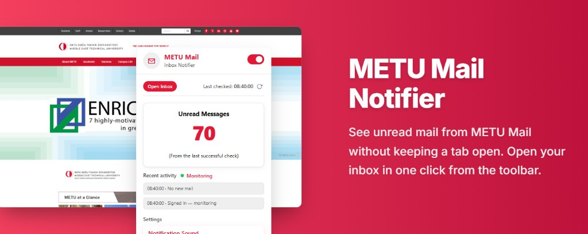

# ✉️ METU Mail Notifier

> Quietly checks your METU Roundcube inbox and uses your browser’s **native notifications** when new mail arrives or when you need to sign in again. An optional in-page banner can appear on your active tab if you explicitly grant **access to all websites** — OS notifications always still fire.




**Repository:** [github.com/ardatrkl35/METU-Mail-Notifier](https://github.com/ardatrkl35/METU-Mail-Notifier)  
**Microsoft Edge Add-ons:** [METU Mail Notifier](https://microsoftedge.microsoft.com/addons/detail/metu-mail-notifier/egjodlpddmcmpgeefnekeglfpbpeldlm)

---

## What It Does

METU Mail Notifier runs a two-state check loop in the background:

| State | What happens |
|---|---|
| **STATE_1 — Logged out** | Probes the webmail inbox page every minute. When a valid session is detected, transitions to STATE_2. If no session exists, may show a “please log in” **OS notification**, throttled to at most once every 30 minutes. |
| **STATE_2 — Logged in** | Calls the Roundcube mail-list API every 5 minutes. Compares message UIDs to detect new mail and shows **OS notifications**. Updates a toolbar **badge** with INBOX unread count (integer only). Detects session expiry and transitions back to STATE_1. |

---

## Features

- **Native notifications** — new mail, login reminders, session expiry, and manual “no new mail” use `chrome.notifications` (OS-level popups); clicking a notification opens METU webmail where supported  
- **Optional in-page toast (Path B)** — if you grant the optional **all websites** permission from the popup, a short banner can appear on your **active** tab in addition to native notifications; nothing replaces the OS notification, and you can revoke the permission anytime  
- **Sound toggle** — when enabled, short chimes play in a hidden extension **offscreen** page for selected OS notifications (see in-product copy for which events include sound); no audio in arbitrary website tabs  
- **Unread in the popup** — shows the same persisted INBOX unread total as the badge while monitoring (no subjects or senders)  
- **Recent activity** — short capped list of non-identifying check outcomes in the popup  
- **Master enable/disable toggle** — pause the entire extension with one click; the check loop stops and resumes instantly; when paused, `inert` locks keyboard focus out of the covered region so the paused state is accessible and predictable  
- **Manual check** — instantly check for new mail from the popup, with visual feedback  
- **Last checked time** — displays the time of the last successful background check  
- **Open Inbox** — opens or focuses an existing METU webmail tab from the popup  
- **Session expiry detection** — detects logout via URL redirect, login-page HTML markers, and Roundcube’s `session_error` exec response  
- **MV3 background stability** — ES module service worker; cold wake reconciles persisted `machineState` through a read-only path so reconciliation does not stack or fight itself  
- **Repository shortcut** — popup footer shows the installed version and opens the public GitHub project in a new tab (ordinary navigation; no analytics)  
- **Zero remote data collection** — nothing is sent to servers operated by this extension  

---

## Popup Settings

| Setting | What it does | Storage |
|---|---|---|
| **Extension Enabled** (header toggle) | Master switch — when off, alarms are cleared and checking stops | `chrome.storage.local` |
| **Notification Sound** | Optional chimes for selected OS notifications | `chrome.storage.local` |
| **Unread Messages** | Read-only display of persisted INBOX unread count | Written by background after successful checks |
| **Recent activity** | Short list of non-identifying outcomes | `chrome.storage.local` (`popupActivityLog`) |
| **In-page toast (optional)** | Grant or revoke optional `<all_urls>` for additive on-page banner | Browser permission model (not stored as a custom flag beyond what Chrome exposes) |
| **Last checked** & **refresh** | Timestamp of last successful check; manual check button | `chrome.storage.local` |

---

## How It Works

```
 ┌──────────────┐  Toggle / options  ┌────────────────────┐
 │  Popup UI    │ ──────────────────► │  chrome.storage    │
 │  popup.js    │  (auto-save)        │       .local       │
 └──────┬───────┘                     └────────────────────┘
        │ storage.onChanged                    │ get()
        ▼                                      ▼
 ┌──────────────────┐              ┌──────────────────────────┐
 │ Service Worker   │              │  background/*.js (ESM)   │
 │ background.js    │              │                          │
 │  (type: module)  │              │  reconcileRuntimeState   │
 │                  │              │  transitionToState()     │
 │  chrome.alarms   │              │  runAuthCheck /          │
 │  auth_check (1m) │              │  runMailCheck, …         │
 │  mail_check (5m) │              └──────────────────────────┘
 └──────┬───────────┘
        │
        ├────────► chrome.notifications (default alerts)
        ├────────► chrome.action.setBadgeText (unread)
        ├────────► optional: scripting + tabs → overlay on active tab
        └────────► optional: offscreen → notification chimes
```

### Step by Step

1. On install or browser startup, the worker reconciles persisted `machineState` and aligns alarms without overlapping reconciliation loops.  
2. `runAuthCheck` may use `chrome.cookies.getAll` scoped to `webmail.metu.edu.tr` as a lightweight gate, then fetches the inbox page with `credentials: "include"`. Login-page markers are checked across the **full** HTML body where applicable.  
3. Once a valid session is detected, the CSRF token is extracted from the inbox HTML, the `mail_check` alarm is scheduled (every 5 minutes), and the state machine moves to STATE_2.  
4. `runMailCheck` calls the Roundcube mail-list API. The response is validated for session errors and login HTML **before** assuming JSON inbox data is trustworthy.  
5. New message UIDs are compared to `lastSeenId` in storage. Unread count and badge text are updated from list parsing — **no** email subjects or senders are read.  
6. **Notifications** are created with `chrome.notifications`. If optional `<all_urls>` is granted, the extension may inject its own `content` scripts into the active tab to show an additive banner; injection is limited to the extension’s bundled files.  
7. Optional chimes are requested through a hidden **offscreen** document (`offscreen/sound.html`) so playback stays in extension context under MV3.  
8. The master toggle and sound preference are written to `chrome.storage.local`. A `storage.onChanged` listener starts or stops the state machine when `extensionEnabled` changes.  

---

## Installation (Microsoft Edge)

Install from the [Microsoft Edge Add-ons listing](https://microsoftedge.microsoft.com/addons/detail/metu-mail-notifier/egjodlpddmcmpgeefnekeglfpbpeldlm), then sign in to [webmail.metu.edu.tr](https://webmail.metu.edu.tr) in the same browser profile so the extension can use your session.

---

## Installation (Manual / Developer Mode)

1. **Download or clone** this repository:
   ```bash
   git clone https://github.com/ardatrkl35/METU-Mail-Notifier.git
   ```

2. Open **Chrome** and navigate to `chrome://extensions/`  
   *(For Edge, navigate to `edge://extensions/`)*

3. Enable **Developer Mode** using the toggle in the top-right corner.

4. Click **Load unpacked** and select the cloned **`METU-Mail-Notifier`** folder (or whatever you renamed it to).

5. The ✉️ icon will appear in your toolbar. Click it to configure settings.

6. **Log in** to [webmail.metu.edu.tr](https://webmail.metu.edu.tr) in the same browser profile. The extension will detect your session within about a minute.

---

## Usage

1. Click the **METU Mail** icon in your browser toolbar.  
2. Use the **Extension Enabled** toggle in the header to pause or resume checking.  
3. Toggle **Notification Sound** if you want optional chimes for selected OS notifications.  
4. Optionally use **Grant access to all websites** only if you want the additive in-page toast; you can revoke it later in the browser’s extension settings.  
5. Keep a browser window open — the service worker needs the browser running to fire alarms.

> **Tip:** The extension does not require the webmail tab to stay open. It uses your existing browser session for `webmail.metu.edu.tr`.

---

## Project Structure

```
METU-Mail-Notifier/
├── manifest.json              # Extension manifest (MV3, ES module worker)
├── LICENSE
├── README.md
├── CHANGELOG.md
├── PRIVACY_POLICY.md
├── docs/
│   └── store-banner.png       # README / store promo graphic
├── icons/
│   └── icon.png
├── background/                # Service worker modules (imported from background.js)
│   ├── background.js          # Small entry / registration
│   └── …                    # state machine, mail/auth checks, notifications, overlay, …
├── content/
│   ├── content.js             # Message handler + overlay behaviour
│   └── overlayDom.js          # DOM construction for the optional banner
├── offscreen/
│   ├── sound.html
│   └── chimePlayback.js       # Optional notification chimes
└── popup/
    ├── popup.html
    ├── popup.css
    └── popup.js
```

---

## Privacy

METU Mail Notifier **does not** operate a remote server or analytics pipeline for your mail checks.

- Processing for checks is local to your device.  
- Automatic network requests for mail are only to `webmail.metu.edu.tr`, using your existing browser session — the same origin your browser would hit with the tab open.  
- No email content (subjects, senders, bodies) is read, stored, or transmitted by the extension. Only numeric identifiers / counts derived from Roundcube list responses are used.  

See [`PRIVACY_POLICY.md`](./PRIVACY_POLICY.md) for the full policy, including every permission and storage key.

---

## Permissions Explained

| Permission | Reason |
|---|---|
| `alarms` | Schedule periodic auth and mail checks that survive service-worker sleep |
| `storage` | Save and read local preferences and state (`extensionEnabled`, `playNotificationSound`, `lastSeenId`, `unreadCount`, `popupActivityLog`, timestamps, `extensionStatus`, `machineState`, internal counters, …) |
| `scripting` | Inject the extension’s own scripts when optional overlay permission is granted |
| `tabs` | Find the active tab for optional overlay injection; open or focus METU webmail; open the GitHub link from the footer |
| `windows` | Focus the window that contains the webmail tab when appropriate |
| `notifications` | Show OS-level notifications (default alert path) |
| `offscreen` | Host a hidden page used only for optional notification chimes |
| `cookies` | Read cookies for `webmail.metu.edu.tr` only, as a local session gate before fetches |
| `host_permissions: https://webmail.metu.edu.tr/*` | Credentialed fetches to METU webmail from the service worker |
| `optional_host_permissions: <all_urls>` | **Optional:** inject the additive in-page banner on the active tab when you explicitly grant it — **not** granted by default at install |

---

## Browser Compatibility

| Browser | Status |
|---|---|
| Google Chrome | Fully supported |
| Microsoft Edge (Chromium) | Fully supported ([Add-ons listing](https://microsoftedge.microsoft.com/addons/detail/metu-mail-notifier/egjodlpddmcmpgeefnekeglfpbpeldlm)) |
| Brave, Opera, Vivaldi | Compatible (Chromium-based) |
| Firefox | Not supported (requires MV2 port) |
| Safari | Not supported |

---

## Known Limitations

- The extension requires the **browser to be running** — alarms do not fire when the browser is closed.  
- It uses your browser’s existing session cookie for `webmail.metu.edu.tr`. It does not store or handle your METU password.  
- If the browser restricts background service-worker wake-ups (e.g. after extended idle), check intervals may be delayed beyond the nominal 1 / 5 minute targets.  
- Optional overlay injection requires an injectable active tab (restricted URLs such as `chrome://` pages cannot host the banner).  

---

## Changelog

See [`CHANGELOG.md`](./CHANGELOG.md) for the full version history.

---

## License

This project is licensed under the **MIT License** — see the [LICENSE](./LICENSE) file for details.

---

*METU Mail Notifier v1.5.0 · MV3 · Chrome / Edge · April 17, 2026*
